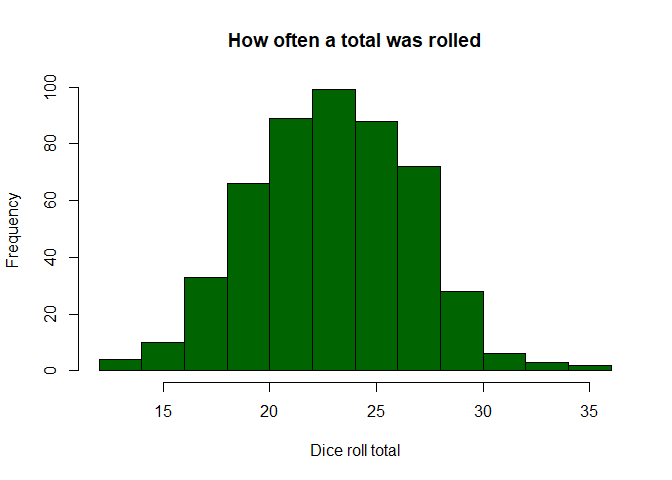

# Introduction to R - The dice Function
Tom Tibbett  


## Background
The function ```dice``` can be used to simulate dice rolls with multiple or atypically sided dice (i.e., four-sided dice, 100-sided dice).  There are three arguments to this function.

* ```sides```: how many sides do the dice have?  The default is a standard six-sided die.
* ```reps```: how many dice are you rolling at once?
* ```adding```: Are there any modifiers you'd like to add after the dice are rolled?  You can add bonuses or levy penalties to a roll. The default is 0.

To Do:

* Create a variable that recognizes negative modifiers and have ```note``` return either ```+``` or ```-``` in the equation when printed.
* Create boolean argument to print dice rolls for QA purposes.

## Dice Function


```r
dice<-function(sides=6, reps, adding=0){
  x<-sample(1:sides, size = reps, replace=TRUE) # With dice, you roll with replacement
  total<-sum(x,na.rm = TRUE) + adding
  note<-paste0(reps,"d",sides," + ", adding)
  #print(note) # If you want to see the notation each time you roll, uncomment this part.
  total
}
```

Let's test it with 3 4-sided dice and adding 6.


```r
dice(sides=4, reps=3, adding=6)
```

```
## [1] 14
```

## Rolls

R is pretty good at doing mindless tasks in a loop.  It is very easy to form sampling distributions of the rolls from ```dice```.  As per the Central Limit Theorem, the resulting distribution of the totals should approach a normal distribution.  Of course, this is contingent on how many times you sample.  For this example, in the below code, I rolled 5 six-sided dice and added six.  Then I did that 499 more times for a 500-element vector of Totals, listed below.


```r
rolls<-0 # Initializing a numeric vector of Totals
for (i in 1:500){
  x<-dice(sides=6, reps=5, adding=6) # Creates a Total
  rolls[i]<-x # Adds this loop's total to the vector of Totals
}
rolls
```

```
##   [1] 28 26 29 22 27 18 20 21 28 22 27 24 22 20 20 27 25 27 21 20 18 26 23
##  [24] 21 28 19 28 26 26 24 21 27 23 27 30 22 16 28 25 28 18 23 20 22 23 26
##  [47] 25 19 19 26 36 18 27 24 28 25 25 23 25 23 27 26 17 24 22 23 20 25 21
##  [70] 25 20 24 28 26 20 19 22 18 30 25 25 16 25 23 26 22 23 27 22 27 19 17
##  [93] 22 21 22 21 19 21 24 24 20 26 25 24 24 21 23 26 23 27 29 19 26 21 26
## [116] 18 20 27 26 22 24 23 22 29 29 27 25 25 27 22 17 23 28 18 14 22 19 17
## [139] 29 24 23 23 18 28 22 26 22 24 27 26 27 27 26 28 23 30 26 24 19 24 24
## [162] 25 22 23 27 23 24 26 20 28 19 22 24 20 24 21 25 22 25 16 28 22 26 28
## [185] 24 20 16 25 25 20 25 22 25 19 27 30 23 24 22 23 24 27 26 25 28 26 22
## [208] 12 26 19 20 21 21 28 29 19 24 18 25 19 27 26 24 21 32 15 27 24 24 22
## [231] 19 22 27 26 20 17 26 22 20 22 17 19 26 22 16 28 25 24 18 25 24 22 27
## [254] 29 23 19 18 22 25 32 26 20 20 29 27 24 27 18 22 22 16 14 23 18 26 22
## [277] 17 21 23 27 29 21 20 25 19 28 28 23 20 24 26 27 28 23 27 27 21 29 25
## [300] 30 24 21 27 23 21 24 17 26 23 26 23 24 21 27 23 25 20 24 26 23 18 19
## [323] 28 20 21 13 26 24 25 23 23 18 29 22 20 21 25 26 20 28 28 19 20 19 18
## [346] 19 21 21 20 22 27 21 23 21 20 23 18 18 26 24 23 26 26 26 22 28 22 16
## [369] 24 31 26 20 22 23 19 20 19 21 18 20 21 29 21 29 23 20 16 35 16 26 24
## [392] 27 23 21 24 23 32 22 20 22 22 24 25 30 29 22 24 28 21 21 24 21 17 26
## [415] 24 24 27 17 26 29 19 24 25 28 33 21 33 26 27 21 19 31 28 23 20 29 22
## [438] 30 19 27 17 25 18 31 28 26 21 24 17 29 23 26 23 30 25 22 25 21 22 27
## [461] 23 28 24 23 30 22 27 28 22 23 20 20 20 24 30 23 22 26 20 25 25 28 24
## [484] 30 25 23 23 21 17 33 25 24 23 22 27 19 22 24 26 28
```

## Histogram of Rolls


```r
hist(rolls, main = "How often a total was rolled", xlab = "Dice roll total", col = "darkgreen")
```

<!-- -->


