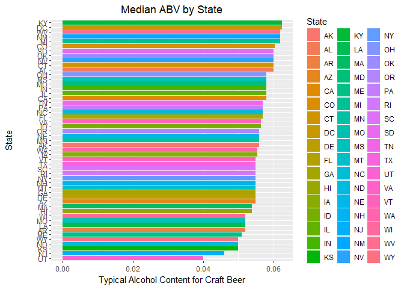
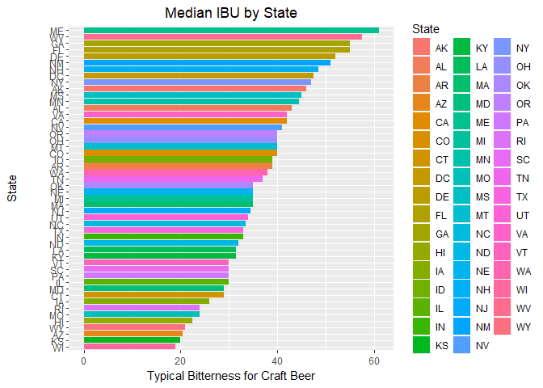
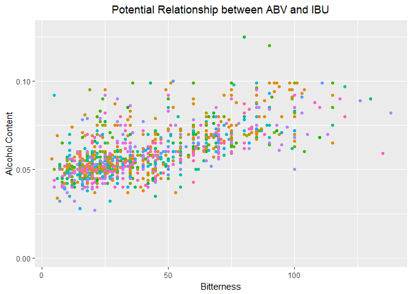

# The Case Study - A Walkthrough
Tom Tibbett  


Disclaimer: It is important to note that this focuses most on the coding questions, but not the presentation aspect of the Case Study.  While you can use this for reference, it is not a true answer key.  I solved most of this with dplyr.

### Libraries and Import


```r
library('dplyr')
```

```
## 
## Attaching package: 'dplyr'
```

```
## The following objects are masked from 'package:stats':
## 
##     filter, lag
```

```
## The following objects are masked from 'package:base':
## 
##     intersect, setdiff, setequal, union
```

```r
library('ggplot2')

beers<-read.csv('../../data/Beers.csv')
brews<-read.csv('../../data/Breweries.csv')

head(beers)
```

```
##                  Name Beer_ID   ABV IBU Brewery_id
## 1            Pub Beer    1436 0.050  NA        409
## 2         Devil's Cup    2265 0.066  NA        178
## 3 Rise of the Phoenix    2264 0.071  NA        178
## 4            Sinister    2263 0.090  NA        178
## 5       Sex and Candy    2262 0.075  NA        178
## 6        Black Exodus    2261 0.077  NA        178
##                            Style Ounces
## 1            American Pale Lager     12
## 2        American Pale Ale (APA)     12
## 3                   American IPA     12
## 4 American Double / Imperial IPA     12
## 5                   American IPA     12
## 6                  Oatmeal Stout     12
```

```r
head(brews)
```

```
##   Brew_ID                      Name          City State
## 1       1        NorthGate Brewing    Minneapolis    MN
## 2       2 Against the Grain Brewery    Louisville    KY
## 3       3  Jack's Abby Craft Lagers    Framingham    MA
## 4       4 Mike Hess Brewing Company     San Diego    CA
## 5       5   Fort Point Beer Company San Francisco    CA
## 6       6     COAST Brewing Company    Charleston    SC
```

How many breweries are in each state?


```r
ct<-data.frame(count(brews, brews$State))
names(ct) <- c("State", "Count")
ct[order(-ct$Count),]
```

```
##    State Count
## 6     CO    47
## 5     CA    39
## 23    MI    32
## 38    OR    29
## 44    TX    28
## 39    PA    25
## 20    MA    23
## 48    WA    23
## 16    IN    22
## 49    WI    20
## 28    NC    19
## 15    IL    18
## 35    NY    16
## 46    VA    16
## 10    FL    15
## 36    OH    15
## 24    MN    12
## 4     AZ    11
## 47    VT    10
## 22    ME     9
## 25    MO     9
## 27    MT     9
## 7     CT     8
## 1     AK     7
## 11    GA     7
## 21    MD     7
## 37    OK     6
## 13    IA     5
## 14    ID     5
## 19    LA     5
## 30    NE     5
## 40    RI     5
## 12    HI     4
## 18    KY     4
## 33    NM     4
## 41    SC     4
## 45    UT     4
## 51    WY     4
## 2     AL     3
## 17    KS     3
## 31    NH     3
## 32    NJ     3
## 43    TN     3
## 3     AR     2
## 9     DE     2
## 26    MS     2
## 34    NV     2
## 8     DC     1
## 29    ND     1
## 42    SD     1
## 50    WV     1
```

### Merging the Data

Next, we should merge beers and breweries on their ID values.  You can either rename both to the same value OR you can use by.x and by.y to match differently named columns that relate to each other.


```r
df<-merge(beers, brews, by.x="Brewery_id", by.y="Brew_ID")
names(df)<- c("BreweryID","BeerName", "BeerID", "ABV","IBU","Style","Ounces","Company","City","State")
```

### Print the First and Last Six

I chose to row-bind ```head()``` and ```tail()``` in order to show both.


```r
rbind(head(df),tail(df))
```

```
##      BreweryID                  BeerName BeerID   ABV IBU
## 1            1              Get Together   2692 0.045  50
## 2            1             Maggie's Leap   2691 0.049  26
## 3            1                Wall's End   2690 0.048  19
## 4            1                   Pumpion   2689 0.060  38
## 5            1                Stronghold   2688 0.060  25
## 6            1               Parapet ESB   2687 0.056  47
## 2405       556             Pilsner Ukiah     98 0.055  NA
## 2406       557  Heinnieweisse Weissebier     52 0.049  NA
## 2407       557           Snapperhead IPA     51 0.068  NA
## 2408       557         Moo Thunder Stout     50 0.049  NA
## 2409       557         Porkslap Pale Ale     49 0.043  NA
## 2410       558 Urban Wilderness Pale Ale     30 0.049  NA
##                                    Style Ounces
## 1                           American IPA     16
## 2                     Milk / Sweet Stout     16
## 3                      English Brown Ale     16
## 4                            Pumpkin Ale     16
## 5                        American Porter     16
## 6    Extra Special / Strong Bitter (ESB)     16
## 2405                     German Pilsener     12
## 2406                          Hefeweizen     12
## 2407                        American IPA     12
## 2408                  Milk / Sweet Stout     12
## 2409             American Pale Ale (APA)     12
## 2410                    English Pale Ale     12
##                            Company          City State
## 1               NorthGate Brewing    Minneapolis    MN
## 2               NorthGate Brewing    Minneapolis    MN
## 3               NorthGate Brewing    Minneapolis    MN
## 4               NorthGate Brewing    Minneapolis    MN
## 5               NorthGate Brewing    Minneapolis    MN
## 6               NorthGate Brewing    Minneapolis    MN
## 2405         Ukiah Brewing Company         Ukiah    CA
## 2406       Butternuts Beer and Ale Garrattsville    NY
## 2407       Butternuts Beer and Ale Garrattsville    NY
## 2408       Butternuts Beer and Ale Garrattsville    NY
## 2409       Butternuts Beer and Ale Garrattsville    NY
## 2410 Sleeping Lady Brewing Company     Anchorage    AK
```

### Exploring NA values

Our client was curious how much data is missing.  To check all rows in one pass:


```r
sapply(X=df, FUN=function(x) sum(is.na(x)))
```

```
## BreweryID  BeerName    BeerID       ABV       IBU     Style    Ounces 
##         0         0         0        62      1005         0         0 
##   Company      City     State 
##         0         0         0
```

```r
colSums(is.na(df))
```

```
## BreweryID  BeerName    BeerID       ABV       IBU     Style    Ounces 
##         0         0         0        62      1005         0         0 
##   Company      City     State 
##         0         0         0
```

### Advanced dplyr use

How about the median for each state?  You can use piping to use several dplyr functions at once.  Here's what this bit of code says in plain English

* ```select()``` only the State and ABV columns; I do not need anything else.
* ```group_by()``` the State in terms of alcohol content
* ```summarize()``` this subset; I want to create a variable called MedianABV, which is the median, absent NAs, rounded to 4 digits.
* ```arrange()``` it in descending order by this new variable, MedianABV.

Essentially, I want it to show me the top States for ABV in terms of the typical beer.


```r
AB <- df %>%
  select(State, ABV) %>%
  group_by(State) %>%
  summarize(MedianABV=round(median(ABV, na.rm=TRUE),4)) %>%
  arrange(desc(MedianABV))

data.frame(AB)  
```

```
##    State MedianABV
## 1     DC    0.0625
## 2     KY    0.0625
## 3     MI    0.0620
## 4     NM    0.0620
## 5     WV    0.0620
## 6     CO    0.0605
## 7     AL    0.0600
## 8     CT    0.0600
## 9     NV    0.0600
## 10    OK    0.0600
## 11    SD    0.0600
## 12    CA    0.0580
## 13    IL    0.0580
## 14    IN    0.0580
## 15    MD    0.0580
## 16    MS    0.0580
## 17    OH    0.0580
## 18    FL    0.0570
## 19    NC    0.0570
## 20    PA    0.0570
## 21    TN    0.0570
## 22    ID    0.0565
## 23    VA    0.0565
## 24    AK    0.0560
## 25    MN    0.0560
## 26    NE    0.0560
## 27    OR    0.0560
## 28    IA    0.0555
## 29    WA    0.0555
## 30    AZ    0.0550
## 31    DE    0.0550
## 32    GA    0.0550
## 33    MT    0.0550
## 34    NH    0.0550
## 35    NY    0.0550
## 36    RI    0.0550
## 37    SC    0.0550
## 38    TX    0.0550
## 39    VT    0.0550
## 40    HI    0.0540
## 41    MA    0.0540
## 42    AR    0.0520
## 43    LA    0.0520
## 44    MO    0.0520
## 45    WI    0.0520
## 46    ME    0.0510
## 47    KS    0.0500
## 48    ND    0.0500
## 49    WY    0.0500
## 50    NJ    0.0460
## 51    UT    0.0400
```

I'll do the same thing here with International Bitterness Units, but I choose to round to five digits instead.


```r
IB<-df %>% # I use dplyr here to do all my steps simultaneously, but you can do this piecemeal in base R, too
  select(State, IBU) %>%
  group_by(State) %>%
  summarize(MedianIBU=round(median(IBU, na.rm=TRUE),5)) %>% # I chose to round to five digits here
  arrange(desc(MedianIBU)) # I put them in descending order because my clients are most interested in higher values
data.frame(IB)
```

```
##    State MedianIBU
## 1     ME      61.0
## 2     WV      57.5
## 3     FL      55.0
## 4     GA      55.0
## 5     DE      52.0
## 6     NM      51.0
## 7     NH      48.5
## 8     DC      47.5
## 9     NY      47.0
## 10    AK      46.0
## 11    MS      45.0
## 12    MN      44.5
## 13    AL      43.0
## 14    CA      42.0
## 15    VA      42.0
## 16    NV      41.0
## 17    CO      40.0
## 18    MT      40.0
## 19    OH      40.0
## 20    OR      40.0
## 21    AR      39.0
## 22    ID      39.0
## 23    WA      38.0
## 24    TN      37.0
## 25    MA      35.0
## 26    MI      35.0
## 27    NE      35.0
## 28    OK      35.0
## 29    NJ      34.5
## 30    UT      34.0
## 31    NC      33.5
## 32    IN      33.0
## 33    TX      33.0
## 34    ND      32.0
## 35    KY      31.5
## 36    LA      31.5
## 37    IL      30.0
## 38    PA      30.0
## 39    SC      30.0
## 40    VT      30.0
## 41    CT      29.0
## 42    MD      29.0
## 43    IA      26.0
## 44    MO      24.0
## 45    RI      24.0
## 46    HI      22.5
## 47    WY      21.0
## 48    AZ      20.5
## 49    KS      20.0
## 50    WI      19.0
## 51    SD        NA
```

### ggplot and Categories

The next task was to graph things to look for patterns.  For ABV, I do the following with this code chunk:

* Reorder the bars in descending order, rather than alphabetical by State.
* Manifest a bar chart, making the fill contingent on the State value in the observation.
* Create an informative title.
* Center that title.
* Label the x and y axis in detail.
* Flip the coordinates -- frequently with categories, the axis values become scrunched.


```r
ggplot(AB, aes(reorder(State, MedianABV), MedianABV)) + # I chose to reorder the bars in descending order, rather than alphabetical  
  geom_bar(aes(fill=State), stat="identity") + # the bar colors and what the values mean
  ggtitle("Median ABV by State") + # The Title
  theme(plot.title = element_text(hjust = 0.5)) + # Centers the Title
  xlab("State\n\n") + # Gives an X-axis name
  ylab("Typical Alcohol Content for Craft Beer") + # Gives an informative Y-axis name
  coord_flip() # Flips the coordinates - I do this because it's easier to see States on the Y-Axis
```

<!-- -->

I'll do the same thing for IBUs.  However, I noticed earlier that some states had no values.  I opt to remove NA values in the first row of this code chunk.


```r
ggplot(IB[!is.na(IB$MedianIBU),], aes(reorder(State, MedianIBU), MedianIBU)) + # I saw that SD had an NA for Bitterness - let's remove
  geom_bar(aes(fill=State), stat="identity") +
  ggtitle("Median IBU by State") +
  theme(plot.title = element_text(hjust = 0.5)) +
  xlab("State\n\n") +
  ylab("Typical Bitterness for Craft Beer") +
  coord_flip()
```

<!-- -->

### Summaries Based on Data

Another objective was to note the most bitter and most alcohol beer.  I also included relevant information, the Name, ABV/IBU, and State.


```r
# Which state has the maximum alcoholic beer?
df[which.max(df$ABV),c("State","BeerName","ABV")]
```

```
##     State                                             BeerName   ABV
## 375    CO Lee Hill Series Vol. 5 - Belgian Style Quadrupel Ale 0.128
```

```r
# Which state has the most bitter beer?
df[which.max(df$IBU),c("State","BeerName","IBU")]
```

```
##      State                  BeerName IBU
## 1857    OR Bitter Bitch Imperial IPA 138
```

You can also use ggplot to create scatterplots.  One ask in the Case Study was to ascertain whether there was a relationship between ABV and IBUs.  I omit the legend and color by State.


```r
ggplot(df, aes(ABV, IBU)) +
  geom_point(aes(color=State), show.legend=FALSE) + # Color the observations by State
  ggtitle("Potential Relationship between ABV and IBU") +
  theme(plot.title = element_text(hjust = 0.5)) +
  xlab("Alcohol Content") +
  ylab("Bitterness") +
  coord_flip()
```

```
## Warning: Removed 1005 rows containing missing values (geom_point).
```

<!-- -->

You can also actually statistically analyze whether there is a relationship.  Consider this linear relationship.


```r
summary(lm(ABV~IBU, data=df))
```

```
## 
## Call:
## lm(formula = ABV ~ IBU, data = df)
## 
## Residuals:
##       Min        1Q    Median        3Q       Max 
## -0.033288 -0.005946 -0.001595  0.004022  0.052006 
## 
## Coefficients:
##              Estimate Std. Error t value Pr(>|t|)    
## (Intercept) 4.493e-02  5.177e-04   86.79   <2e-16 ***
## IBU         3.508e-04  1.036e-05   33.86   <2e-16 ***
## ---
## Signif. codes:  0 '***' 0.001 '**' 0.01 '*' 0.05 '.' 0.1 ' ' 1
## 
## Residual standard error: 0.01007 on 1403 degrees of freedom
##   (1005 observations deleted due to missingness)
## Multiple R-squared:  0.4497,	Adjusted R-squared:  0.4493 
## F-statistic:  1147 on 1 and 1403 DF,  p-value: < 2.2e-16
```
