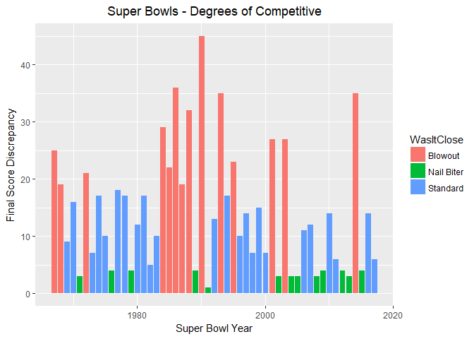

# Preparing Data for Analysis - A Primer
Tom Tibbett  


In this demo, I'll be grabbing some data from online and turning it into something usable.  Make sure you have the relevant libraries installed and ready to go.

### Library Import


```r
library("rvest")   # Great for grabbing and parsing HTML
```

```
## Warning: package 'rvest' was built under R version 3.4.2
```

```
## Loading required package: xml2
```

```r
library("dplyr")   # Easy transformation of data.frames for summarization
```

```
## 
## Attaching package: 'dplyr'
```

```
## The following objects are masked from 'package:stats':
## 
##     filter, lag
```

```
## The following objects are masked from 'package:base':
## 
##     intersect, setdiff, setequal, union
```

```r
library("tidyr")   # Nice way to arrange data
```

```
## Warning: package 'tidyr' was built under R version 3.4.2
```

```r
library("ggplot2") # Excellent for visuals
```

We are going to pull some data from the ESPN website.  Feel free to take a look at the URL below.


```r
url <- 'http://espn.go.com/nfl/superbowl/history/winners'
webpage<- read_html(url)
```

Using rvest, I'm going to grab some of the HTML in order to investigate nodes of interest: namely, the table.


```r
sb_table<-html_nodes(webpage, 'table')
sb<-html_table(sb_table)
```

Then, I'm going to turn this into a data frame we can (sort of) use.


```r
a<-data.frame(sb)
names(a)<-a[2,]
df<-slice(a, 3:length(a$RESULT))
df
```

```
## # A tibble: 51 x 4
##      NO.          DATE                          SITE
##    <chr>         <chr>                         <chr>
##  1     I Jan. 15, 1967 Los Angeles Memorial Coliseum
##  2    II Jan. 14, 1968           Orange Bowl (Miami)
##  3   III Jan. 12, 1969           Orange Bowl (Miami)
##  4    IV Jan. 11, 1970  Tulane Stadium (New Orleans)
##  5     V Jan. 17, 1971           Orange Bowl (Miami)
##  6    VI Jan. 16, 1972  Tulane Stadium (New Orleans)
##  7   VII Jan. 14, 1973 Los Angeles Memorial Coliseum
##  8  VIII Jan. 13, 1974        Rice Stadium (Houston)
##  9    IX Jan. 12, 1975  Tulane Stadium (New Orleans)
## 10     X Jan. 18, 1976           Orange Bowl (Miami)
## # ... with 41 more rows, and 1 more variables: RESULT <chr>
```

### Regular Expressions

It looks like there are four potential variables in one column.  Team1, Team1's score, Team2, and Team2's score.  I can easily split the two of them with a comma using the ```separate()``` function in dplyr.  But the problem after that is how to separate Teams from their score. 

If you notice, there are some issues with simply splitting columns by spaces, like we did we Team1's variables and Team2's.  Teams like "Green Bay" have two spaces before their score.  We'll have to devise another strategy.  One way is regular expressions.  I highly recommend researching ```regex``` online.

Here, I do the following in order.

* ```[ ]``` - match a single character present in the set: here I chose a space.
* ```(?= )``` - positive lookahead
* ```[^ ]``` - match a single character NOT present in the set: here I chose not a space
* ```+``` - matches at least once
* ```$``` - asserts position at the end of the line
 
So, it says:

* Look for a space.
* Got it?  Now, right after that, look ahead for a not-space.
* Is it the last one on the line? If so, split it!

It will go character by character until it finds the last space of the string.


```r
clean<-df %>%
  separate(RESULT, into=c("Team1", "Team2"), sep=", ") %>%
  # After splitting this way, I want the last 'word' from each column
  separate(Team1, into=c("Team1", "Team1_Score"),sep="[ ](?=[^ ]+$)") %>%
  separate(Team2, into=c("Team2", "Team2_Score"),sep="[ ](?=[^ ]+$)")

clean
```

```
## # A tibble: 51 x 7
##      NO.          DATE                          SITE         Team1
##  * <chr>         <chr>                         <chr>         <chr>
##  1     I Jan. 15, 1967 Los Angeles Memorial Coliseum     Green Bay
##  2    II Jan. 14, 1968           Orange Bowl (Miami)     Green Bay
##  3   III Jan. 12, 1969           Orange Bowl (Miami) New York Jets
##  4    IV Jan. 11, 1970  Tulane Stadium (New Orleans)   Kansas City
##  5     V Jan. 17, 1971           Orange Bowl (Miami)     Baltimore
##  6    VI Jan. 16, 1972  Tulane Stadium (New Orleans)        Dallas
##  7   VII Jan. 14, 1973 Los Angeles Memorial Coliseum         Miami
##  8  VIII Jan. 13, 1974        Rice Stadium (Houston)         Miami
##  9    IX Jan. 12, 1975  Tulane Stadium (New Orleans)    Pittsburgh
## 10     X Jan. 18, 1976           Orange Bowl (Miami)    Pittsburgh
## # ... with 41 more rows, and 3 more variables: Team1_Score <chr>,
## #   Team2 <chr>, Team2_Score <chr>
```

Now, let's make this a dataframe and alter the column names.


```r
df<-data.frame(clean)
names(df) <- c("SuperBowl", "Date", "Site", "Team1", "Team1_Score", "Team2", "Team2_Score")
head(df)
```

```
##   SuperBowl          Date                          Site         Team1
## 1         I Jan. 15, 1967 Los Angeles Memorial Coliseum     Green Bay
## 2        II Jan. 14, 1968           Orange Bowl (Miami)     Green Bay
## 3       III Jan. 12, 1969           Orange Bowl (Miami) New York Jets
## 4        IV Jan. 11, 1970  Tulane Stadium (New Orleans)   Kansas City
## 5         V Jan. 17, 1971           Orange Bowl (Miami)     Baltimore
## 6        VI Jan. 16, 1972  Tulane Stadium (New Orleans)        Dallas
##   Team1_Score       Team2 Team2_Score
## 1          35 Kansas City          10
## 2          33     Oakland          14
## 3          16   Baltimore           7
## 4          23   Minnesota           7
## 5          16      Dallas          13
## 6          24       Miami           3
```

### Troubleshooting

One problem we have is that the data is not in the right format to be utilized for anything.  We need to change that.

```r
data.frame(sapply(df, class))
```

```
##             sapply.df..class.
## SuperBowl           character
## Date                character
## Site                character
## Team1               character
## Team1_Score         character
## Team2               character
## Team2_Score         character
```

Fortunately, we can very easily coerce these variables to other types, given the format.  For our date variable, especially, it's important to look up the keys for month, day, and year formats and combine them.  Checking again, we see that our dataframe has changed to the appropriate type.


```r
df[,c("Team1_Score", "Team2_Score")]<-sapply(df[,c("Team1_Score", "Team2_Score")], as.numeric) # Our numeric variables.
df$Date<-as.Date(df$Date, format='%b. %d, %Y') # Our date variable.

data.frame(sapply(df, class))
```

```
##             sapply.df..class.
## SuperBowl           character
## Date                     Date
## Site                character
## Team1               character
## Team1_Score           numeric
## Team2               character
## Team2_Score           numeric
```

Now that we've converted our columns to numeric, we can use ```dplyr``` and ```tidyr``` to process our data.


```r
df %>%
  count(Team1) %>%
  arrange(desc(n))
```

```
## # A tibble: 25 x 2
##              Team1     n
##              <chr> <int>
##  1          Dallas     5
##  2      Pittsburgh     5
##  3   San Francisco     5
##  4 New York Giants     4
##  5       Green Bay     3
##  6     New England     3
##  7      Washington     3
##  8       Baltimore     2
##  9          Denver     2
## 10           Miami     2
## # ... with 15 more rows
```

Always be ready for curveballs.  If we look at the ```unique()``` values, we can see that there are some discrepancies in recording.  Occasionally, there are only locations.  But sometimes, a team name is attached.  This is worth fact-checking later, but for the moment, we'll assume the records are correct and do not need editing.


```r
unique(df$Team1)
```

```
##  [1] "Green Bay"            "New York Jets"        "Kansas City"         
##  [4] "Baltimore"            "Dallas"               "Miami"               
##  [7] "Pittsburgh"           "Oakland"              "San Francisco"       
## [10] "Washington"           "Los Angeles"          "Chicago"             
## [13] "New York Giants"      "Denver"               "St. Louis"           
## [16] "New England"          "Tampa Bay"            "Indianapolis"        
## [19] "Pittsburgh Steelers"  "New Orleans Saints"   "Green Bay Packers"   
## [22] "Baltimore Ravens"     "Seattle Seahawks"     "New England Patriots"
## [25] "Denver Broncos"
```

### Making Something from Nothing

My friend is unfamiliar with American football, and the Super Bowl is coming up.  He would like to watch five Super Bowls to amp himself up for his first live event.  However, he's not sure where to begin and asks me for help.  He wants to watch an exciting, competitive match.  He asks me to choose some good ones to watch.

I can use this data that I have created to visualize how competitive each Super Bowl is and create a spoiler-free list for him.  I decide to use quartiles to determine when a game is either a nail-biter or a blowout.  From the ```summary```, I can grab and create metrics from the Victory Spread: the distance in final score between Team1 and Team2.


```r
df["VictorySpread"]<- abs(df["Team1_Score"]-df["Team2_Score"]) # I use absolute value here because Team2 might outscore Team1.

summary(df$VictorySpread)
```

```
##    Min. 1st Qu.  Median    Mean 3rd Qu.    Max. 
##    1.00    4.50   12.00   14.16   19.00   45.00
```

```r
FQ<-as.numeric(summary(df$VictorySpread)[2]) # This is the first quartile that I grab
TQ<-as.numeric(summary(df$VictorySpread)[5]) # This is the third.
```

Using these metrics, I can create a column categorizing whether something is a close game, a standard one, or a blowout.


```r
df["WasItClose"]<-"Standard" # Make everything standard at first, then overwrite!
df$WasItClose[which(df$VictorySpread<=FQ)] <- "Nail Biter" # Lower than first quartile might be extremely competitive
df$WasItClose[which(df$VictorySpread>=TQ)] <- "Blowout" # Higher than the third quartile might be hilariously uncompetitive
```

Let's plot this.

* Because I converted the ```Date``` column to datetime format, it can be plotted on an axis!
* I use VictorySpread as the height of the bars.
* I color the bars by ```WasItClose```.
* I give an informative title.
* I rename the axes.


```r
ggplot(df, aes(Date, VictorySpread))+
  geom_bar(aes(fill=WasItClose), stat="identity")+
  ggtitle("Super Bowls - Degrees of Competitive") +
  theme(plot.title = element_text(hjust = 0.5)) +
  xlab("Super Bowl Year") +
  ylab("Final Score Discrepancy")
```

<!-- -->

Finally, I can deliver the list using ```dplyr``` and ```tidyr``` piping.

* I ```select``` four of the columns I need.
* I ```filter``` the observations so that only Nail Biter games remain.
* I ```arrange``` the dataset by ascending Victory Spread; if there are ties, secondary order is by most recent.
* I ```slice``` the result so that only the Top Five remain.
* To remove spoilers, I un```select``` the variables I do not need anymore.


```r
watchthese<-df %>%
  select(SuperBowl,VictorySpread,WasItClose, Date) %>% # Select These Variables Only
  filter(WasItClose=="Nail Biter") %>% # Only consider Nail Biters
  arrange(VictorySpread,desc(Date)) %>% # Arrange them by score and how recent they were
  slice(1:5) %>% # Pick the closest - in event of a tie, prioritize most recent
  select(-WasItClose, -VictorySpread) # Remove the Spoilers

data.frame(watchthese)
```

```
##   SuperBowl       Date
## 1       XXV 1991-01-27
## 2     XLVII 2013-02-03
## 3      XLII 2008-02-03
## 4     XXXIX 2005-02-06
## 5   XXXVIII 2004-02-01
```

